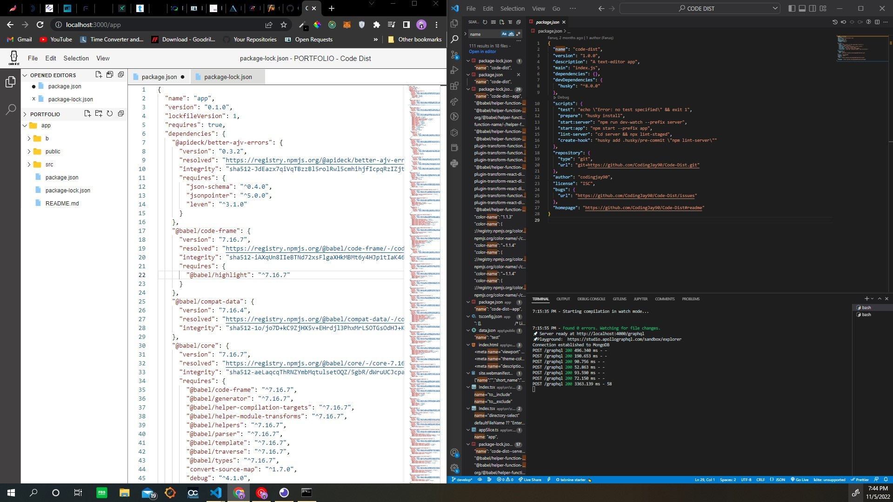
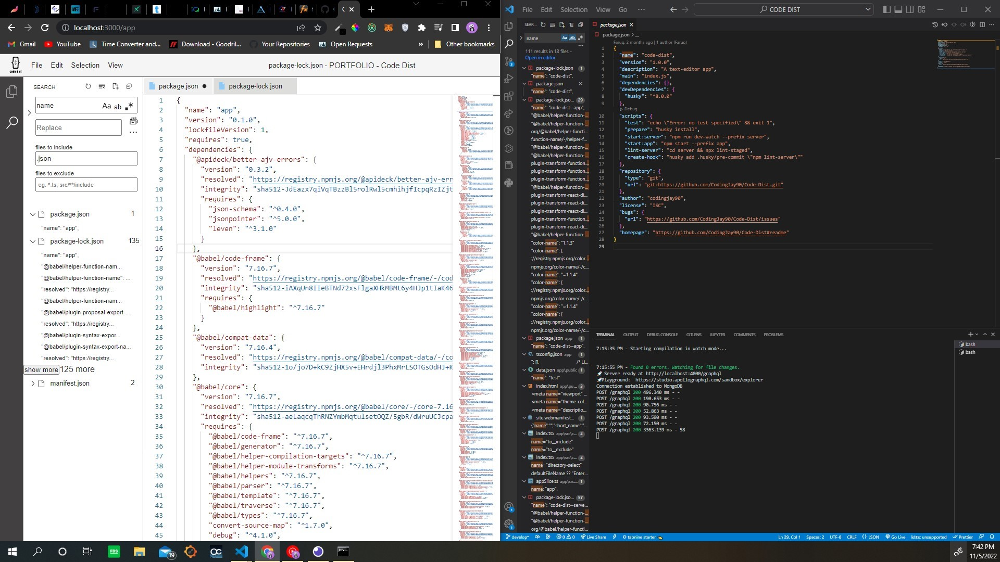

# Code Dist

A text-editor app with vs-code features

# Environment vars

This project uses the following environment variables:

| Name      | Description     | Default Value                   |
| --------- | --------------- | ------------------------------- |
| NODE_ENV  | node enviroment | "developemnt"                   |
| PORT      | ""              | 4000                            |
| MONGO_URL | "database url"  | "mongodb://localhost/code-dist" |

# Getting started

- Clone the repository

```
git clone  https://github.com/CodingJay90/Code-Dist.git <project_name>
```

- Install dependencies

```
cd <project_name>
npm run install-package
```

- run the server

```
npm run start:server
```

- run the app

```
npm run start:app
Navigate to `http://localhost:3000`
```

## Technologies

- ReactJS
- MongoDB
- GraphQl

## Demo

The project should look like this:




## Author

Faruq Akolade<br>
email: akoladefaruq42@gmail.com
